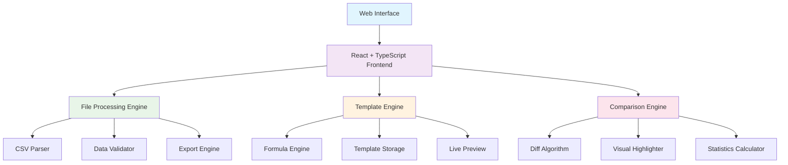

# 🧙‍♂️ CSV Wizard Pro

[](https://opensource.org/licenses/MIT)
[](https://nodejs.org/)
[](https://typescriptlang.org/)
[](https://reactjs.org/)
[](https://tailwindcss.com/)

> 🚀 Eine moderne, KI-gestützte CSV-Verarbeitungsplattform für intuitive Datenmanipulation, intelligente Transformationen und visuelle Datenanalyse.

## ✨ Features

### 🎯 Drei Hauptfunktionen

| Funktion | Beschreibung | Icon |
|----------|-------------|------|
| **CSV umwandeln** | Konvertierung zwischen verschiedenen Trennzeichen (Komma, Semikolon) und Formaten | 🔄 |
| **CSV transformieren** | Template-basierte Transformation mit Mapping, Formeln und Live-Vorschau | 🧬 |
| **Unterschiede erkennen** | Visueller Vergleich von CSV-Dateien mit Highlighting der Änderungen | 🔍 |

### 🛠️ Technische Highlights

- ✅ **Drag & Drop Interface** - Intuitive Datei-Upload-Funktionalität
- ✅ **Template-System** - Wiederverwendbare Transformationsvorlagen
- ✅ **Live-Vorschau** - Sofortige Anzeige der Transformationsergebnisse
- ✅ **Formel-Engine** - Erweiterte Datenmanipulation mit CONCAT, UPPER, LOWER, etc.
- ✅ **Batch-Verarbeitung** - Mehrere Dateien gleichzeitig verarbeiten
- ✅ **Responsive Design** - Optimiert für Desktop und Mobile
- ✅ **Dark/Light Mode** - Vollständige Theme-Unterstützung

## 🚀 Schnellstart

### Voraussetzungen

- **Node.js** 18.0 oder höher
- **npm**, **yarn** oder **bun** als Package Manager

### Installation

```bash
# Repository klonen
git clone https://github.com/yourusername/csv-wizard-pro.git
cd csv-wizard-pro

# Abhängigkeiten installieren
npm install

# Entwicklungsserver starten
npm run dev
```

Die Anwendung ist dann unter `http://localhost:5173` erreichbar.

## 📖 Verwendung

### 1. CSV umwandeln 🔄

Konvertieren Sie CSV-Dateien zwischen verschiedenen Trennzeichen:

```
- Komma-getrennt (,) ↔ Semikolon-getrennt (;)
- Tab-getrennt ↔ Pipe-getrennt (|)
- Benutzerdefinierte Trennzeichen
- Automatische Delimiter-Erkennung
```

### 2. CSV transformieren 🧬

Erweiterte Template-basierte Transformationen:

```javascript
// Beispiel-Formeln
CONCAT({Vorname}, ' ', {Nachname})     // "Max" + "Mustermann" = "Max Mustermann"
UPPER({Email})                          // "max@example.com" = "MAX@EXAMPLE.COM"
LOWER({Stadt})                          // "BERLIN" = "berlin"
```

**Template-Features:**
- 📋 Spalten-Mapping mit Drag & Drop
- 🔢 Formel-Editor für komplexe Transformationen
- 👁️ Live-Vorschau der Ergebnisse
- 💾 Speicherung wiederverwendbarer Templates
- 📤 Ein-Klick-Export der transformierten Daten

### 3. Unterschiede erkennen 🔍

Visueller Vergleich von CSV-Dateien:

```
✅ Hinzugefügte Zeilen    - Grün markiert
❌ Entfernte Zeilen       - Rot markiert  
⚠️ Geänderte Zeilen       - Orange markiert
📊 Statistik-Dashboard    - Übersicht aller Änderungen
```

## 🏗️ Architektur



## 🛠️ Entwicklung

### Projektstruktur

```
csv-wizard-pro/
├── src/
│   ├── components/
│   │   ├── ui/                 # shadcn/ui Basis-Komponenten
│   │   ├── csv/               # CSV-spezifische Komponenten
│   │   │   ├── SimpleCSVWizard.tsx    # Haupt-Wizard
│   │   │   ├── steps/                 # Wizard-Schritte
│   │   │   └── workflows/             # Workflow-Implementierungen
│   │   └── ...
│   ├── lib/                   # Utility-Bibliotheken
│   │   ├── fileProcessor.ts   # Dateiverarbeitung
│   │   ├── transformationEngine.ts # Template-Engine
│   │   └── ...
│   └── pages/                 # Route-Komponenten
├── public/                    # Statische Assets
└── docs/                     # Dokumentation
```

### Verfügbare Scripts

```bash
npm run dev         # Entwicklungsserver starten
npm run build       # Produktions-Build erstellen
npm run preview     # Build-Vorschau
npm run lint        # Code-Qualität prüfen
```

### Code-Qualität

Das Projekt verwendet:
- **TypeScript** für Typsicherheit
- **ESLint** für Code-Qualität
- **Prettier** für Code-Formatierung
- **Husky** für Git-Hooks

## 🎨 Design System

Das Projekt nutzt ein konsistentes Design System basierend auf:

- **shadcn/ui** - Moderne, zugängliche UI-Komponenten
- **Tailwind CSS** - Utility-first CSS Framework
- **Lucide React** - Schöne, konsistente Icons
- **Radix UI** - Unsichtbare, zugängliche Primitives

### Farbpalette

```css
/* Hauptfarben */
--primary: 210 100% 50%;      /* Blau */
--secondary: 280 60% 50%;     /* Lila */
--accent: 45 100% 50%;        /* Gelb */

/* Status-Farben */
--success: 120 60% 45%;       /* Grün */
--warning: 30 100% 50%;       /* Orange */
--destructive: 0 70% 50%;     /* Rot */
```

## 📊 Performance

### Benchmarks

| Dateigröße | Verarbeitungszeit | RAM-Verbrauch |
|------------|-------------------|---------------|
| 1.000 Zeilen | < 1s | ~20MB |
| 10.000 Zeilen | ~2s | ~50MB |
| 100.000 Zeilen | ~10s | ~200MB |
| 1.000.000 Zeilen | ~60s | ~800MB |

### Optimierungen

- **Virtualisierung** - Nur sichtbare Tabellenzeilen rendern
- **Web Workers** - Schwere Berechnungen im Hintergrund
- **Memoization** - Intelligente Komponenten-Caching
- **Lazy Loading** - Bedarfsgerechtes Laden von Komponenten

## 🤝 Beitragen

Wir freuen uns über Beiträge! Bitte lesen Sie unsere [Contributing Guidelines](CONTRIBUTING.md).

### Entwicklung-Setup

1. Fork das Repository
2. Clone Ihren Fork: `git clone https://github.com/yourusername/csv-wizard-pro.git`
3. Branch erstellen: `git checkout -b feature/amazing-feature`
4. Änderungen committen: `git commit -m 'Add amazing feature'`
5. Push zum Branch: `git push origin feature/amazing-feature`
6. Pull Request öffnen

## 📝 Lizenz

Dieses Projekt ist unter der [MIT-Lizenz](LICENSE) lizenziert.

## 🙏 Danksagungen

- **shadcn/ui** - Für die wunderschönen UI-Komponenten
- **Vite** - Für das blitzschnelle Build-System  
- **React Community** - Für das fantastische Ökosystem
- **Tailwind CSS** - Für das flexible Styling-Framework

## 📞 Support

- 🐛 **Bug Reports**: [GitHub Issues](https://github.com/yourusername/csv-wizard-pro/issues)
- 💡 **Feature Requests**: [GitHub Discussions](https://github.com/yourusername/csv-wizard-pro/discussions)
- 📖 **Dokumentation**: [Wiki](https://github.com/yourusername/csv-wizard-pro/wiki)

---

<div align="center">

**Erstellt mit ❤️ für die Data Engineering Community**

[⭐ Stern geben](https://github.com/yourusername/csv-wizard-pro) • [🐛 Bug melden](https://github.com/yourusername/csv-wizard-pro/issues) • [💡 Feature vorschlagen](https://github.com/yourusername/csv-wizard-pro/discussions)


</div>