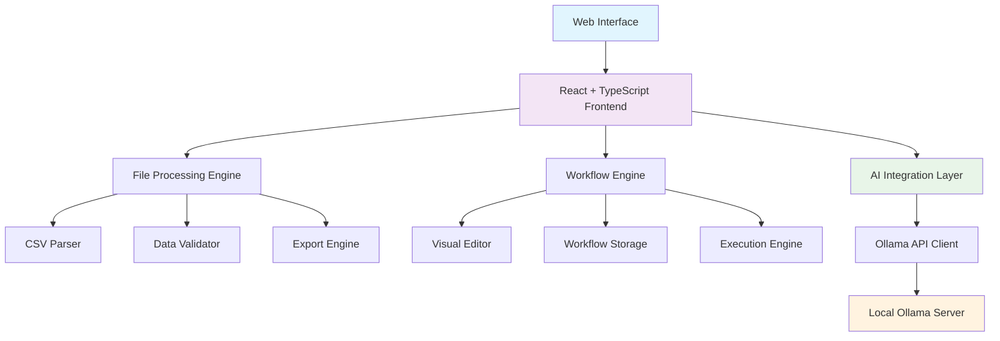

# Ollama Flow - KI-gestützte ETL-Plattform

[](https://opensource.org/licenses/MIT)
[](https://nodejs.org/)
[](https://typescriptlang.org/)
[](https://reactjs.org/)
[](https://tailwindcss.com/)

Eine moderne, KI-gestützte ETL (Extract, Transform, Load) Plattform für die intuitive Verarbeitung und Transformation von CSV-Daten mit lokaler Ollama-Integration.

## ✨ Features

### 🎯 Kernfunktionalitäten
- **Multi-Datei Import**: Gleichzeitiger Import mehrerer CSV-Dateien
- **Intelligente Datenvorschau**: Interaktive Vorschau mit konfigurierbaren Parse-Einstellungen
- **KI-gestützte Transformation**: Natürlichsprachige Datenbearbeitung via Ollama
- **Visueller Workflow-Editor**: Drag-and-Drop Interface für komplexe Datenverarbeitungspipelines
- **Workflow-Hub**: Zentrale Verwaltung und Wiederverwendung gespeicherter Workflows

### 🤖 KI-Integration
- **Lokale Ollama-Integration**: Vollständige Privatsphäre durch lokale KI-Verarbeitung
- **Dynamische Modellauswahl**: Automatische Erkennung verfügbarer Ollama-Modelle
- **Intelligente Datenanalyse**: Automatische Erkennung von Datenmustern und Anomalien
- **Natürlichsprachige Transformation**: Beschreiben Sie Transformationen in natürlicher Sprache

### 🔧 Erweiterte Funktionen
- **Automatische Updates**: Integrierter Update-Mechanismus mit GitHub-Integration
- **Responsive Design**: Optimiert für Desktop und mobile Geräte
- **Dark/Light Mode**: Vollständige Theme-Unterstützung
- **Export-Funktionen**: CSV, JSON und weitere Formate
- **Batch-Verarbeitung**: Anwendung von Workflows auf mehrere Dateien

## 🏗️ Architektur



## 🚀 Schnellstart

### Automatische Installation

```bash
# Mit curl
curl -fsSL https://raw.githubusercontent.com/jahartmann/ollama-flow/main/install.sh | bash

# Oder manuell
git clone https://github.com/jahartmann/ollama-flow.git
cd ollama-flow
chmod +x install.sh
./install.sh
```

Das Installationsskript führt automatisch folgende Schritte aus:
- ✅ Überprüfung der Systemvoraussetzungen
- ✅ Installation der Abhängigkeiten
- ✅ Ollama-Setup und Modell-Download
- ✅ Umgebungskonfiguration
- ✅ Start des Entwicklungsservers

### Manuelle Installation

```bash
# 1. Repository klonen
git clone https://github.com/jahartmann/ollama-flow.git
cd ollama-flow

# 2. Abhängigkeiten installieren
npm install
# oder
yarn install
# oder
bun install

# 3. Ollama installieren und starten
curl -fsSL https://ollama.ai/install.sh | sh
ollama serve

# 4. Empfohlenes Modell herunterladen
ollama pull llama3.2:latest

# 5. Entwicklungsserver starten
npm run dev
```

## 📋 Systemvoraussetzungen

- **Node.js**: Version 18.0 oder höher
- **RAM**: Mindestens 8GB (16GB empfohlen für größere Datasets)
- **Festplatte**: 5GB freier Speicherplatz
- **Ollama**: Für KI-Funktionen (automatisch installiert)

### Unterstützte Betriebssysteme
- ✅ Linux (Ubuntu 20.04+, CentOS 8+, Debian 11+)
- ✅ macOS (10.15+)
- ✅ Windows 10+ (mit WSL2 empfohlen)

## 🎮 Verwendung

### 1. ETL-Wizard

Erstellen Sie präzise Transformationspläne:

```
1. Ollama-Verbindung testen
2. Quelldateien definieren
3. Ziel-Schema festlegen
4. Transformationsregeln beschreiben
5. Automatisch generierten Plan überprüfen
```

### 2. Datenvorschau

Importieren und validieren Sie Ihre Daten:

```typescript
// Unterstützte Formate
const supportedFormats = [
  'CSV (Comma-separated values)',
  'TSV (Tab-separated values)', 
  'Pipe-separated values',
  'Custom delimiters'
];

// Encoding-Unterstützung
const supportedEncodings = [
  'UTF-8', 'ISO-8859-1', 'Windows-1252', 'UTF-16'
];
```

### 3. KI-gestützte Transformation

Beispiele für natürlichsprachige Transformationen:

```
"Teile die Spalte 'Vollständiger Name' in 'Vorname' und 'Nachname' auf"
"Konvertiere alle E-Mail-Adressen in Kleinbuchstaben"
"Fülle fehlende PLZ basierend auf der Stadt auf"
"Erstelle eine neue Spalte 'Kategorie' basierend auf dem Produktpreis"
```

### 4. Workflow-Hub

Verwalten Sie wiederverwendbare Workflows:

- **Erstellen**: Neue Workflows im visuellen Editor
- **Organisieren**: Kategorisierung nach Typ (Bereinigung, Transformation, Analyse)
- **Ausführen**: Ein-Klick-Ausführung auf neuen Datensätzen
- **Teilen**: Export/Import von Workflow-Definitionen

## 🔧 Konfiguration

### Ollama-Einstellungen

```bash
# Standard-Konfiguration
OLLAMA_HOST=0.0.0.0:11434
OLLAMA_MODELS_DIR=~/.ollama/models

# Empfohlene Modelle
ollama pull llama3.2:latest     # Allgemeine Aufgaben
ollama pull mistral:7b          # Code-Generation
ollama pull phi3:medium         # Datenanalyse
```

### Umgebungsvariablen

```env
# .env.local
VITE_OLLAMA_BASE_URL=http://localhost:11434
VITE_DEFAULT_MODEL=llama3.2:latest
VITE_APP_NAME="ETL Automation Expert"
VITE_DEV_MODE=true
```

## 🛠️ Entwicklung

### Projektstruktur

```
ollama-flow/
├── src/
│   ├── components/          # React-Komponenten
│   │   ├── ui/             # Basis-UI-Komponenten (shadcn/ui)
│   │   ├── ETLWizard.tsx   # Haupt-ETL-Assistent
│   │   ├── DataPreview.tsx # Datenvorschau-Komponente
│   │   └── ...
│   ├── lib/                # Utility-Bibliotheken
│   │   ├── ollamaApi.ts    # Ollama-Integration
│   │   ├── fileProcessor.ts # Dateiverarbeitung
│   │   └── workflowStorage.ts # Workflow-Management
│   ├── hooks/              # Custom React Hooks
│   └── pages/              # Routing-Komponenten
├── public/                 # Statische Assets
├── install.sh             # Installationsskript
└── README.md              # Diese Datei
```

### Verfügbare Scripts

```bash
# Entwicklung
npm run dev          # Entwicklungsserver starten
npm run build        # Produktions-Build erstellen
npm run preview      # Build-Vorschau

# Code-Qualität
npm run lint         # ESLint ausführen
npm run type-check   # TypeScript-Typen prüfen

# Tests
npm run test         # Test-Suite ausführen
npm run test:coverage # Coverage-Report erstellen
```

### Beitragen

1. **Fork** das Repository
2. **Clone** Ihren Fork: `git clone https://github.com/yourusername/ollama-flow.git`
3. **Branch** erstellen: `git checkout -b feature/amazing-feature`
4. **Changes** committen: `git commit -m 'Add amazing feature'`
5. **Push** zum Branch: `git push origin feature/amazing-feature`
6. **Pull Request** öffnen

## 📊 Performance

### Benchmarks

| Dataset-Größe | Verarbeitungszeit | RAM-Verbrauch |
|---------------|-------------------|---------------|
| 1K Zeilen     | < 1s             | ~50MB         |
| 10K Zeilen    | ~2-3s            | ~100MB        |
| 100K Zeilen   | ~15-20s          | ~500MB        |
| 1M Zeilen     | ~2-3min          | ~2GB          |

### Optimierungen

- **Streaming-Verarbeitung**: Für große Dateien
- **Worker-Threads**: CPU-intensive Transformationen
- **Lazy Loading**: UI-Komponenten
- **Memoization**: Wiederverwendbare Berechnungen

## 🔒 Sicherheit & Datenschutz

- ✅ **Lokale Verarbeitung**: Keine Daten verlassen Ihr System
- ✅ **Keine Cloud-Abhängigkeiten**: Vollständig offline funktionsfähig
- ✅ **Verschlüsselung**: Workflow-Speicherung mit AES-256
- ✅ **Audit-Logs**: Vollständige Nachverfolgbarkeit aller Operationen

## 🐛 Troubleshooting

### Häufige Probleme

**Problem**: Ollama-Verbindung fehlgeschlagen
```bash
# Lösung: Ollama-Service neu starten
killall ollama
ollama serve
```

**Problem**: Speicher-Fehler bei großen Dateien
```bash
# Lösung: Node.js Heap-Limit erhöhen
export NODE_OPTIONS="--max-old-space-size=8192"
npm run dev
```

**Problem**: Port bereits belegt
```bash
# Lösung: Alternativen Port verwenden
npm run dev -- --port 3001
```

### Logs und Debugging

```bash
# Ollama-Logs anzeigen
journalctl -u ollama -f

# Anwendungs-Logs (Entwicklung)
# Öffnen Sie die Browser-Entwicklertools (F12)

# Workflow-Ausführungslogs
ls ~/.ollama-flow/logs/
```

## 📈 Roadmap

### Version 2.0 (Q2 2024)
- [ ] **Database-Integration**: PostgreSQL, MySQL, SQLite Support
- [ ] **API-Konnektoren**: REST, GraphQL, SOAP
- [ ] **Echtzeit-Verarbeitung**: Stream-Processing mit Apache Kafka
- [ ] **Cloud-Deployment**: Docker, Kubernetes Templates

### Version 2.1 (Q3 2024)
- [ ] **Kollaboration**: Multi-User Support
- [ ] **Versionierung**: Git-ähnliches Workflow-Versioning
- [ ] **Marketplace**: Community-Workflow-Sharing
- [ ] **Mobile App**: iOS/Android Companion App

## 🤝 Community

- **GitHub Issues**: [Bug Reports & Feature Requests](https://github.com/jahartmann/ollama-flow/issues)
- **GitHub Discussions**: [Diskussionen](https://github.com/jahartmann/ollama-flow/discussions)
- **Documentation**: [Wiki](https://github.com/jahartmann/ollama-flow/wiki)

## 📄 Lizenz

Dieses Projekt ist unter der [MIT-Lizenz](LICENSE) lizenziert.

## 🙏 Danksagungen

- **Ollama Team** - Für die exzellente lokale KI-Runtime
- **shadcn/ui** - Für die wunderschönen UI-Komponenten
- **Vite Team** - Für das blitzschnelle Build-System
- **React Community** - Für das fantastische Ökosystem

---

<div align="center">

**Erstellt mit ❤️ für die Data Engineering Community**

[⭐ Stern geben](https://github.com/jahartmann/ollama-flow) • [🐛 Bug melden](https://github.com/jahartmann/ollama-flow/issues) • [💡 Feature vorschlagen](https://github.com/jahartmann/ollama-flow/discussions)

</div>